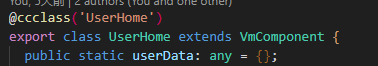

# ccvm
> cocos creator 以数据为基准驱动节点及节点组件变化的框架，当被关联的数据在发生变化后节点及节点上挂在的组件将会自动进行同步。
#### 1.开发模式的转变
- **重点关注**
    - 数据的构造及维护
    - 建立节点或节点上挂在的组件与数据的绑定关系
- **尽量避免**
    - 非做动画时尽量少获取节点及节点组件的引用来进行直接调整 如:尽量少用`getChildByName`、`getChildByPath`、`getComponent`等获得节点或组件进行手动操作
      > 即便是`tween动画`也建议用`VmTransValue`组件来配合`VmTransCfg`类型数据来完成，其他需要引用节点或节点组件的也可以使用`VmRefs`组件来进行
#### 2.功能划分
- **路由**(一小部分)
  >控制主要界面的切换逻辑（前进、后退等）
- **数据与节点及节点组件的关系建立**（主要）
  >构件数据、建立数据与节点或节点组件的绑定关系

#### 3.数据构件与数据绑定
##### 数据源与子节点关系架构图
- **数据源覆盖范围**
  >所有继承自`VmComponent`组件对应的子节点（包括无限孙级节点）均可通过`VmNode/VmRoot/VmSelf`与当前的`VmComponent`提供的数据进行关联<br>
- **数据源作用域及作用域遮罩图**
  >所有`VmComponent`节点对应的子组件上如果也包含`VmComponent`组件则会产生数据源应用范围的（屏蔽）,但是可通过`VmRoot`来突破遮罩<br>
##### 数据源准备
- **创建类并继承VmComponent** 代码编写规范请参考 [VmComponent编写](#VmComponent)
  > `VmComponent`类继承自`cc.Component`,所以继承了`VmComponent`具备`cc.Component`的全部属性及方法（只是额外提供了构造可驱动数据的相关方法）
- **设置为数据源**
  > 只有设置为数据源的才可为子节点提供数据（勾选`isVmNode`属性，默认勾选）在勾选`isVmNode`了时也可设置`vmRootName`属性的值为`vmRoot`作为对应的`VmRoot`的数据源组件（没有`VmRoot`绑定需求的不需要设置而`vmRootName`属性的值）<br>
##### 建立绑定关系
- **在需要数据的子节点添加绑定组件**
  - `VmNode`与具有`VmComponent`且勾选了`isVmNode`的父级节点中最近的一级建立绑定关系
  - `VmRoot`并设置`VmRootName`属性与父级节点中最近一级具有`VmComponent`且勾选了`isVmNode`且有相同的`VmRootName`组件数据进行绑定
  - `VmSelf`建立与自身节点的`VmComponent`且勾选了`isVmNode`的组件建立数据绑定关系
  - 循环列表请参考 [循环列表](#vmfor)
- **绑定组件属性设置**
  > 
  - 1.`bindActive` 节点显示或隐藏的条件表达式：如：`1000<50` 或 `a===b` 或 `a<b && a>c`等 其中`a/b/c`为数据源组件的属性，当被依赖的数据发生变化时会自动重新计算决定节点的显示状态
  - 2.`binds`可设置0条或多条绑定表达式来同步当前节点或当前节点上挂载的组件数据，如：`Label.string=a+b`或`Sprite.spriteFrame=img`等 `=`的前半部分代表需要为当前节点或当前节点的某组件的某属性设置值`=`后半部分则为以数据源中的属性为基础数据的表达式
    >由于某些节点属性或节点组件属性使用频率太高所以支持别名设置，所有别名设置使用`:`前缀，如：`:text=a`等价于`Label.string=a`、`:src=img`等价于`Sprite.spriteFrame=img` 其它别名请参考[binds别名](#bind-alias)
  - 3.`events`对当前节点注册指定事件并触发表达式的执行或数据源函数的执行 如：`touch-start=tapfunc` 或 `touch-start=tapcount+=1` `tapfunc`为数据源组件的一个方法 `tapcount`为数据源组件的一个number类型的属性
    >`events`也支持部分常见的别名，别名使用`@`前缀 如：`@start=tapfunc`等同`touch-start=tapfunc` 且拓展了 `@click=tapfunc`(点击) `@lone=tapfunc`(长按) 更多事件别名请参考[事件别名](#event-alias)
  - 4.`vmRootName`只有`VmRoot`组件才有的属性，用于匹配父级`VmComponent`且`vmRootName`相同的组件作为数据源

#### 数据传递
  >这的数据传输主要是指多个不同的VmComponent之间传输数据
   - 父子关系
      - 父`VmComponent`向子`VmComponent`传递数据
        - 父`VmComponent`构造数据
        - 子`VmComponent`申明`props`并在对应添加绑定组件进行绑定
          > 例：父`VmComponent`申明数据<br><br>子`VmComponent`申明porps<br><br>并且使用`VmNode`进行数据绑定<br><br>此处`vm.seasonData`是简写写法正常写法是`UserRemuneration.seasonData`。注：所有`VmComponent**`组件且勾选了`isVmNode`在进行绑定时均可使用`vm`替代
      - 子`VmComponent`向父`VmComponent`传数据
        - 在父`VmComponent`中申明事件侦听函数
        - 在子`VmComponent`所有在节点的数据绑定组件（`VmNode/VmRoot`）的events中定义绑定表达式
        - 在子`VmComponent`所有在节点`emit`事件对应的事件并传递参数
          >例：父 `VmComponent`申明事件侦听函数<br><br>子`VmComponent`对应的绑定组件添加侦听表达式<br><br>然后触发事件<br>
   - 跨多级`VmComponent`或共享数据传递
      - 使用类的静态属性传递 然后使用`mapStatic`方法关联到对应的组件计算属性（`computed`）
        >步骤：<br>1.声明静态属性<br> <br>2.引入`mapStatic`方法<br><br>3.映射到计算属性<br><br>4.使用数据<br><br>
        疑问：为什么不直接使用静态属性而非得用`mapStatic`?<br>答：因为直接使用静态属性的话，当静态属性值发生变化后，用到这个数据的地方不会自动同步，而用了`mapStatic`的话则我们就不用操心数据同步的问题。
      - 使用共享对象属性传递 然后使用`mapObject`方法关联到对应的组件计算属性（`computed`）
        >与`mapStatic`几乎一样（只有声明处有区别）

#### 主要模块概览
```ts
"ccvm/VmComponent.ts" // 数据依赖对象，继承自cc.Component
"ccvm/VmNode.ts" //建立 "当前节点的任意组件任意属性" 与 "最近一级继承自VmComponent且isVmNode为true的父组件的数据" 的绑定关系，继承自cc.Component
"ccvm/VmSelf.ts" //建立 "当前节点的任意组件任意属性" 与 "自生VmComponent组件数据" 的绑定关系，继承自cc.Component
"ccvm/VmRoot.ts" //建立 "当前节点任意组件任意属性" 与 "最近一级继承自VmComponent且vmRootName值相同的自生和父级组件的数据" 的绑定关系，继承自cc.Component
"ccvm/VmRefs.ts" //获取当前节点或节点上的组件引用并设置到数据源的配置的refs指定的属性中
"ccvm/VmEvent.ts" //拓展事件与绑定事件类关联简称，拓展点击click、长按long、离开over 简写start、end、move、cancel
"ccvm/VmForNode.ts" //声明循环列表容器
"ccvm/VmForItem.ts" //声明循环列表项类型声明（需要多种不同类型才需要，如有的文本与图片混合循环的列表）
"ccvm/VmForArray.ts" //提供给循环列表的数据类型（主要针对频繁增加的列表）
"ccvm/VmTransValue.ts" //读取VmTransCfg数据让当前节点执行tween动画
"ccvm/VmFabLoad.ts" //动态载入指定预制件
"ccvm/Router.ts" //配置项目路由
```

#### <span id="VmComponent">`VmComponent`编写<span>
```ts
import { VmComponent, VmOptions } from '../../ccvm/VmComponent';

export class FreePoint extends VmComponent {
    count:number=0;
    vmOptions: VmOptions={
        data:["count"]
    };
}
```
- `vmOptions`可配置项
```ts

type ComputedFunctions = { [key: string]: (_return?: (value: any) => any, valifresh?: () => boolean) => any }
//watch类型
type WatchItem = {
    [key: string]: Function | WatchOption,//其他值
    _?: Function//默认值
}
type WatchOption = { [key: string]: WatchItem | Function }
export interface VmOptions {
    data?: string[]|{},
    props?: string[]|{},
    refs?: string[]|{},
    depth?: { [key: string]: number },//数据观察深度
    watch?: WatchOption,
    watchImmediate?: string[],//保证初始化立即执行1次
    watchStartImmediate?: string[],//保证最迟start后至少执行1次
    methods?: { [key: string]: Function | null } | string[],//配置函数
    events?: { [key: string]: Function | null } | string[],//事件相应函数
    filters?: { [key: string]: Function | null } | string[],//过滤器相关函数
    computed?: ComputedFunctions,/*计算属性 配置有返回值的函数 如果不能计时得到值(存在异步)时，可给函数定义1和或2个函数参数 给第一个参数(函数)传值作为异步返回值 调用第二个参数（函数）可得到一个布尔值用于验证新鲜度 注意：无第2个参数时自动验证 实例如下：
    computed{
        //同步方式 也是最常用的方式
        timevalue(){
            return new Date(this.timestring).getTime();//通过返回值决定计算属性timevalue的值
        },
        timevalue1(_return){
            _return(0);//未计算出值时使用的临时值（值类型需要符合该计算属性的类型要求）
            const timestring=this.timestring;
            setTimeout(()=>{
                _return(new Date(timestring).getTime());//通过调用_return函数来异步决定计算属性timevalue1的值（会自动验证新鲜度）
            },this.delay)
        },
        timevalue2(_return,valifresh){
            _return(0);//未计算出值时使用的临时值（值类型需要符合该计算属性的类型要求）
            const timestring=this.timestring;
            setTimeout(()=>{
                valifresh() && _return(new Date(timestring).getTime());//通过调用_return函数来异步决定计算属性timevalue1的值（但是调用前需要手动验证新鲜度否则不能确保计算属性值的准确性）
            },this.delay)
        }
    }
    */
    tempHelp?: {},//附加表达式取值变量集合如从cc中导出的对象
    created?: Function,//初始化完成执行
    mounted?: Function,//参数准备就绪执行
    enabled?: Function,//onEnable的后置执行函数
    onLoad?: Function,//生命周期函数同cc默认
    onEnable?: Function,//生命周期函数同cc默认
    start?: Function,//生命周期函数同cc默认
    update?: Function,//生命周期函数同cc默认
    lateUpdate?: Function//生命周期函数同cc默认,
    onDisable?: Function,//生命周期函数同cc默认
    onDestroy?: Function,//生命周期函数同cc默认
}
```
  
##### `VmRefs`获取节点引用
- 获取当前节点或节点上关联的组件引用并设置到数据源组件的refs配置的属性中，多用高频率于代码直接控制节点时如绘制或tween动画等。


#### <span id="vmfor">循环列表</span>
>根据指定的数据创建/删除/更新列表
  ##### 工作流程及组件关系
  - 准备 **循环数据** 在数据源`VmComponent`中准备数据,数据可以是`any[]`或`{}`或`number`或`VmForArray` （支持直接在`VmForNode`配置字面量）
  - 为 **容器节点** 添加`VmForNode`并配置循环数据及相关参数
  - 配置 **子节点模板** 默认容器节点的第1个子节点，当item需要多样性时可以创建多个不同的子节点并添加`VmForItem`且设置渲染条件
```
/*****数据源（VmComponent）代码******/
public btnlist: any[] = [
        { text: "战斗", id: 20 },
        { text: "商店", id: 35 },
        { text: "人物", id: 53 }
    ]
```

  ##### VmForNode 配置
  >
  - 1. **nodePool** 节点对象池最大存储数量（-1时可通过`poolquote`配置共享对象池）
    >对于频繁变动的列表配置合理大小的对象池可以降低item创建与销毁的频率（尽可能复用节点对象池内缓存节点）从而提高性能
  - 2. **poolquote** 当存在多处相同item模板循环列表时，可以指定数据源提供的一个数组作为共享对象池（减少内存的占用），但对象池大小及清空则需要手动管理
  - 3. **mapdata** 需要循环的数据（属性名或字面量）表达式支持`any[]`或`{}`或`number`或`VmForArray`
    >number时代表要产生指定数量的子节点
  - 4. **variables** 为循环子节点item及背部节点执行域额外提供变量用逗号隔开分别用于依次映射数据项item、索引index、键名key、循环数组长度length
    >以btnlist数据为例 假如variables值设为：o,i,k,l 则：
    第1个节点 读取到的o为btnlist[0],i为0,k为0，l为3
    第2个节点 读取到的o为btnlist[1],i为0,k为1，l为3
    第3个节点 读取到的o为btnlist[2],i为0,k为2，l为3
  ##### VmForItem 配置
  ><br>通过if配置的表达式确定使用使用当前模板渲染当前数据项
  ##### VmForArray 类
  >专门为`VmForNode.mapdata`提供数据的类，用于不刷新原有列表的前提下新增列表项（构造函数需要传入一个数组作为参数）
   - **属性**
     - `length`列表数据长度（number）
     - `active`数据激活状态（boolean）设置为false时添加数据不会促发VmForNode追加子节点
   - **方法** 
     - `push` 向列表尾部追加1个或多个数据（多个时用,隔开）
     - `concat` 将某的数组的所有数据项追加到列表尾部
     - `reset` 重置VmForArray数据（以一个新数组作为参数）


#### 补充说明
##### `bindActive、binds、events`额外补充属性
- `$vm`：同`VmNode`的数据源属性，主要用于`VmRoot`获取`VmNode`中的属性
- `$this`：当前节点的绑定节点自生组件
- `$event`：`events`特有属性、用于获取事件的原始数据

##### <span id="bind-alias">`binds`别名</span>（使用:为前缀）
  > 在日常开发中很多节点属性或组件属性使用使用频率高写法也复杂，所以可以改通过简化的别名来进行替代，别名前需要以:为前缀如：`:text=a+".png"`同`Label.string=a+".png"`，支持的所有别名参考如下源码片段
```ts
    alias: Cfg = {
        text: "Label.string",//设置文本
        rText: "RichText.string",//设置富文本
        fontSize: "Label.fontSize",//设置文本大小
        lineHeight: "Label.lineHeight",//设置行高
        color: "Label.hexColorStr",//使用扩展属性 用法  :color="#ffffff"
        bgColor: "Sprite.hexColorStr",//使用扩展属性 用法   :color="#ff0000"
        src: "Sprite.spriteFrame",//设置图片
        image: "VmImage.src",//直接使用字符串path对应的图片作为Sprite的显示内容，使用这个属性会先判断node上是否有VmImage组件没有时会自动添加(不需要带png后缀) 用法 :image="images/bg"
        "image#1": "VmImage.src",//同image区别在于image会在图片没有加载成功之前依然用原来的图片而image#1则是在图片没有加载成功之前使用VmImage配置的默认图片没有默认图片
        fabsrc: "VmFabLoad.src",//动态载入prefab 用法  :fabsrc="prefabs/header.prefab"
        width: "UITransform.width",//设置节点宽度
        height: "UITransform.height",//设置节点高度
        anchorX: "UITransform.anchorX",//设置节点锚点x位置
        anchorY: "UITransform.anchorY",//设置节点锚点y位置
        widthUP: "UITransform.widthUP",//扩展属性基本等同width区别在于widthUP会强制刷新不限子级节点的的Wiaget
        heightUP: "UITransform.heightUP",//扩展属性 意义同widthUP
        widthUP2: "UITransform.widthUP2",//在widthUP的基础上增加一次延迟刷新子节点Wiaget
        heightUP2: "UITransform.heightUP2",//在heightUP的基础上增加一次延迟刷新子节点Wiaget
        x: "node.x",//设置节点x轴位置
        y: "node.y",//设置节点y轴位置
        z: "node.z",//设置节点z轴位置
        rotation: "node.rotationZ",//扩展属性沿z轴旋转角度数
        scale: "node.scale",//设置节点缩放值
        scaleX: "node.scaleX",//设置节点x轴方向缩放值
        scaleY: "node.scaleY",//设置节点y轴方向缩放值
        scaleZ: "node.scaleZ",//设置节点z轴方向缩放值
        opacity: "UIOpacity.opacity"//设置节点透明度
    };
```
##### <span id="event-alias">`events`别名</span>(需要在简写事件前使用@符号)
  - `@start` 按下 同原生事件`touch-start`
  - `@end` 抬起 同原生事件`touch-end`
  - `@move` 移动 同原生事件`touch-move`
  - `@cancel` 取消 同原生事件`touch-cancel`
  - `@click` 点击 扩展事件类似事件click（结合一系列基础事件计算）
  - `@over` 移除 扩展事件类似事件（结合一系列基础事件计算）
  - `@long` 长按 扩展事件（结合一系列基础事件计算）
```ts
export enum VmEventType {
    //事件简称 同cc系统提供事件
    START = "touch-start",
    END = "touch-end",
    MOVE = "touch-move",
    CANCEL = "touch-cancel"
}
export enum VmExpandEvent {
    //拓展事件
    CLICK = "vm-click", //点击事件按下松开在较短事件内完成且没有明显滑动趋势
    OVER = "vm-over",//松开或滑出
    LONG = "vm-long"//长按事件
}
//大小写均可以 如@start=xxfunc  @end @move @cancel @click @over @long
```


##### `VmImage`异步加载图片或多个图片资源切换
> 用于提供动态控制cc.Sprite 的 spriteFrame值的方案
- `preloads: SpriteFrame[]` 可能使用到的spriteFrame集合
- `src:number|string` 值为数值时则直接从preloads取出对应下标的值 为path时异步加载图片 加载成功后读取其spriteFrame 并赋值给cc.Sprite
- `defaultSpriteFrame:SpriteFrame` 默认图片，当src为path时加载过程中零时应用的SpriteFrame
- `autoRelease:boolean` 异步加载成功后的图片被切换后或者节点被移除后是否自动销毁资源
  
##### `VmFabLoad`异步加预制件或多预制件资源切换
```ts
    src: string | number | Prefab = "0";//资源地址
    delay: number = 0;//延迟时间
    autoRelease: boolean = true;//是否自动释放资源
    morecfg: boolean = false

    container: Node;//默认容器节点
    comptemplet: Node;//组件模板
    usecomps: string = "";//要应用的组件
    preloads: Prefab[] = [];//预加载的预制件
    loading: Node;//loading元素
```
  